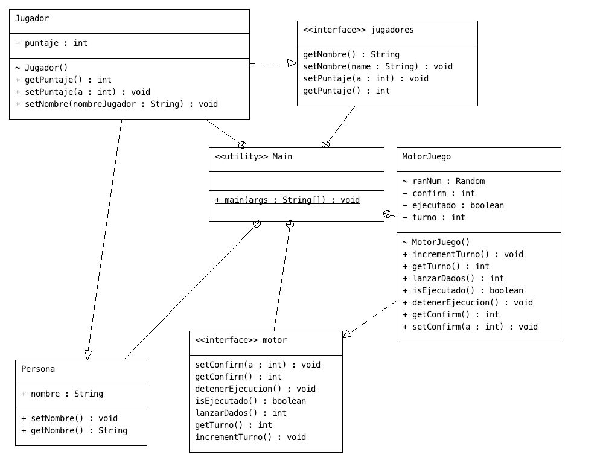

# Proyecto-de-herencia-y-polimorfismo

Escribe un programa en java para simular un juego de dados. Las reglas de juego del juego
de dados conocido son: cada dado tiene 6 lados, estos lados contienen 1, 2, 3, 4, 5, 6
puntos, después de lanzar los dos dados, se calcula la suma de los puntos. El jugador con
más puntos gana; el empate es el mismo si los puntos son los mismos.
Se describe a continuación ciertas recomendaciones.

 **Considere el uso de varias clases
 **Solo son dos jugadores
 **Debe contar los puntos para cada uno y determinar el ganador
 **Controlar turnos y la jugada
 **Mostrar los puntos del ganador
 **Uso de una herramienta colaborativa

 

